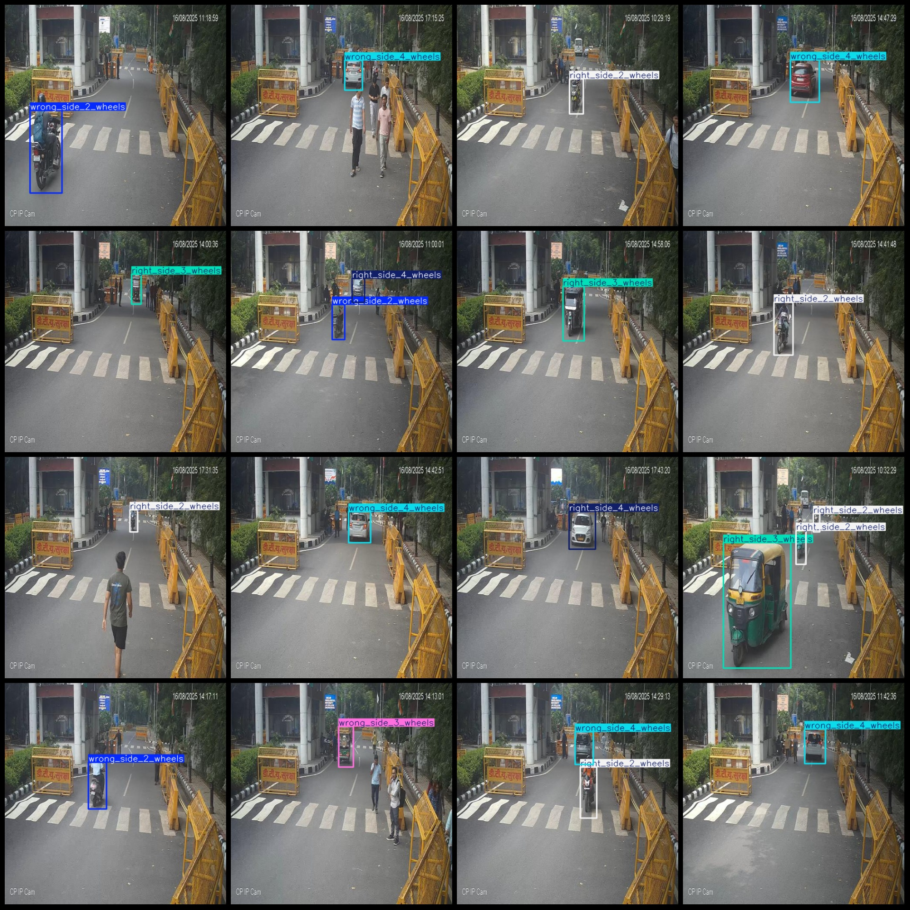
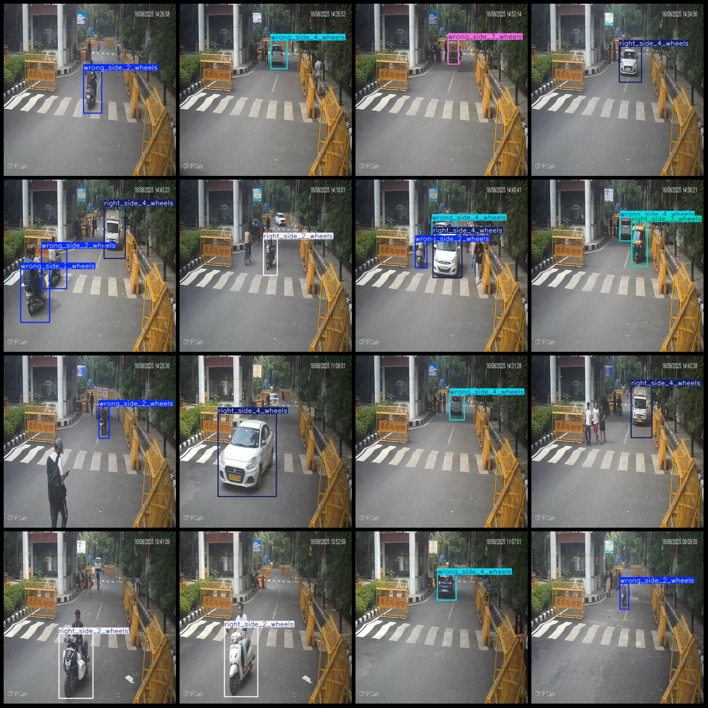

# Smart Traffic Bicycle, Tricycle and Four-Wheeler Reverse Detection Dataset (VOC+YOLO format) 1021 Images in 6 Categories

Dataset format: Pascal VOC format + YOLO format (txt files without split paths, only including jpg images and corresponding VOC format xml files and yolo format txt files)
Number of images (jpg file count): 1021
Number of annotations (xml file count): 1021
Number of annotations (txt file count): 1021
Number of annotation categories: 6
Annotation category names (note that the order of categories in the yolo format is not consistent with this, but follows labels folder classes.txt): ["right_side_2_wheels", "right_side_3_wheels", "right_side_4_wheels", "wrong_side_2_wheels", "wrong_side_3_wheels", "wrong_side_4_wheels"]
Each category has a number of bounding boxes:
right_side_2_wheels (normal 2-wheel) Bounding box count = 331
right_side_3_wheels (normal 3-wheel) Bounding box count = 106
right_side_4_wheels (normal 4-wheel) Bounding box count = 242
wrong_side_2_wheels (incorrect 2-wheel) Bounding box count = 276
wrong_side_3_wheels (incorrect 3-wheel) Bounding box count = 84
wrong_side_4_wheels (incorrect 4-wheel) Bounding box count = 229
Total bounding boxes: 1268
Each category occupies a number of images:
right_side_2_wheels (normal 2-wheel) occupying images = 307
right_side_3_wheels (normal 3-wheel) occupying images = 106
right_side_4_wheels (normal 4-wheel) occupying images = 237
wrong_side_2_wheels (reversed 2-wheel) occupying images = 261
wrong_side_3_wheels (reversed 3-wheel) occupying images = 84
wrong_side_4_wheels (reversed 4-wheel) occupying images = 222
Image resolution: 512x512
Using labelImg for labeling tools
Labeling rules: Draw a rectangle around the category
Important note: The dataset does not have split into training validation and test sets, you need to do it yourself.
Special declaration: This dataset does not guarantee the accuracy of the trained model or the weight files.
Image preview:

```

```
## Images





Here is a pay link on Stripe ( https://buy.stripe.com/3cs8yP7sY87d0vu9AB ). Please contact me lonlonago@foxmail.com after funding $89, and I will send you a complete data files , thank you!

